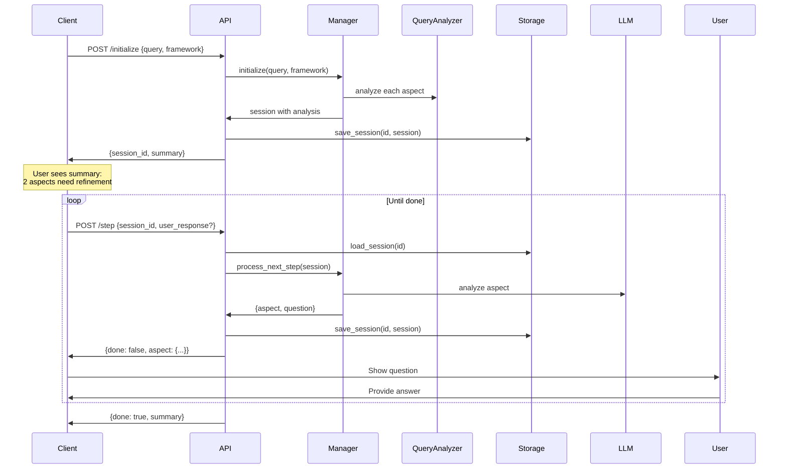

# API Integration Guide

This guide shows how to build a stateless REST API using the Query Refinement Module with session persistence.

## Architecture Overview

```
┌─────────────┐        ┌──────────────────┐        ┌─────────────────┐
│   Client    │◄──────►│   REST API       │◄──────►│ Session Storage │
│ (Frontend)  │        │ (FastAPI/Flask)  │        │ (Redis/DB)      │
└─────────────┘        └──────────────────┘        └─────────────────┘
                                │
                                ▼
                       ┌──────────────────┐
                       │ QueryRefinement  │
                       │    Manager       │
                       └──────────────────┘
```

## Key Components

### 1. Session Storage Interface

The module provides `SessionStorageInterface` for session persistence:

```python
from query_refinement_module.interfaces import SessionStorageInterface

class SessionStorageInterface(ABC):
    def save_session(self, session_id: str, session: Any) -> None: ...
    def load_session(self, session_id: str) -> Any: ...
    def delete_session(self, session_id: str) -> None: ...
    def session_exists(self, session_id: str) -> bool: ...
```

Implement this interface using your preferred backend:
- **Redis** - Fast, TTL support, simple
- **PostgreSQL** - Durable, query-able, ACID
- **File System** - No dependencies, development/testing
- **MongoDB** - Document store, flexible

### 2. API Endpoints

#### POST /api/v1/refine/initialize

Initialize a new refinement session.

**Request:**
```json
{
  "query": "effects of aspirin on stroke",
  "framework_id": "pico"
}
```

**Response:**
```json
{
  "session_id": "550e8400-e29b-41d4-a716-446655440000",
  "summary": {
    "total_aspects": 4,
    "aspects_needing_refinement": 2,
    "aspects_clear": 2,
    "is_complete": false
  },
  "next_prompt": {
    "aspect_id": "outcome",
    "aspect_name": "Outcome",
    "question": "What specific stroke outcomes are you interested in?",
    "description": "What outcome is being measured"
  }
}
```

**What happens:**
1. Creates `QueryRefinementSession`
2. Analyzes all aspects sequentially with dependency context
3. Generates session ID
4. Saves session to storage
5. Returns summary with aspects needing refinement + reasons

#### POST /api/v1/refine/step

Process one refinement interaction.

**Request (first call):**
```json
{
  "session_id": "550e8400..."
}
```

**Response:**
```json
{
  "done": false,
  "aspect": {
    "aspect_id": "outcome",
    "aspect_name": "Outcome",
    "question": "Outcome",
    "response": "What specific stroke outcomes are you interested in? (mortality, recurrence, disability)",
    "error": false
  }
}
```

**Request (with user answer):**
```json
{
  "session_id": "550e8400...",
  "user_response": "stroke recurrence within 1 year"
}
```

**Response (when complete):**
```json
{
  "done": true,
  "summary": {
    "total_steps": 4,
    "completed": 4,
    "total_follow_ups": 2
  }
}
```

**What happens:**
1. Loads session from storage
2. If `user_response` provided, stores it for active aspect
3. Calls `manager.process_next_step(session)` - ONE LLM interaction
4. Saves updated session
5. Returns next question or done signal

#### GET /api/v1/refine/session/{session_id}/summary

Get current session status.

**Response:**
```json
{
  "is_complete": false,
  "total_steps": 4,
  "completed": 2,
  "in_progress": 2,
  "total_follow_ups": 2,
  "steps": [...]
}
```

#### DELETE /api/v1/refine/session/{session_id}

Clean up session.

## Implementation Example

See `docs/api_examples.md` for complete working examples including:
- FastAPI with Redis
- Client-side usage
- Batch processing
- PostgreSQL storage

## Client Flow



## Error Handling

### Session Not Found (404)
```json
{
  "status_code": 404,
  "detail": "Session 550e8400... not found or expired"
}
```

**Causes:**
- Session expired (TTL exceeded)
- Invalid session ID
- Session deleted

**Recovery:**
- Start new session with `/initialize`

### LLM Error (500)
```json
{
  "aspect": {
    "error": true,
    "response": "[LLM error: ...]"
  }
}
```

**Causes:**
- LLM API failure
- Rate limiting
- Invalid prompts

**Recovery:**
- Retry the request
- Check LLM provider status
- Verify configuration

## Session TTL Recommendations

| Use Case         | Recommended TTL | Storage     |
| ---------------- | --------------- | ----------- |
| Interactive UI   | 1-2 hours       | Redis       |
| Batch Processing | 5-10 minutes    | Redis       |
| Long-running     | 24 hours        | PostgreSQL  |
| Testing          | No expiry       | File/Memory |

## Security Considerations

1. **Session IDs**: Use UUIDs, not sequential integers
2. **Validation**: Validate all user inputs
3. **Rate Limiting**: Protect `/initialize` endpoint
4. **Storage**: Encrypt sensitive session data
5. **TTL**: Always set expiration to prevent storage bloat

## Performance Optimization

### 1. Redis Connection Pooling
```python
redis_pool = redis.ConnectionPool(
    host='localhost',
    port=6379,
    max_connections=50
)
redis_client = redis.Redis(connection_pool=redis_pool)
```

### 2. Async API Handlers
```python
@app.post("/api/v1/refine/initialize")
async def initialize_refinement(request: InitializeRequest):
    # Non-blocking I/O operations
    session = await manager.initialize_async(...)
```

### 3. Batch Analysis
If your `QueryAnalyzerInterface` supports it:
```python
if analyzer.supports_batch_analysis():
    # Faster initialization (1 LLM call vs N calls)
    results = analyzer.batch_analyze(query, framework)
```

## Monitoring & Tracing

Use the `TracingProviderInterface` to track:
- Session initialization time
- LLM call latency
- Aspect analysis results
- Error rates

```python
from query_refinement_module.interfaces import TracingProviderInterface

class DatadogTracing(TracingProviderInterface):
    def trace_operation(self, name, operation_type="function", metadata=None):
        # Send traces to Datadog
        ...
```

## Next Steps

1. Implement `SessionStorageInterface` for your storage backend
2. Set up REST API endpoints (FastAPI/Flask/Django)
3. Add authentication/authorization
4. Configure LLM and analyzer implementations
5. Set up monitoring and tracing
6. Deploy with load balancer for horizontal scaling

See `docs/api_examples.md` for complete code examples.
